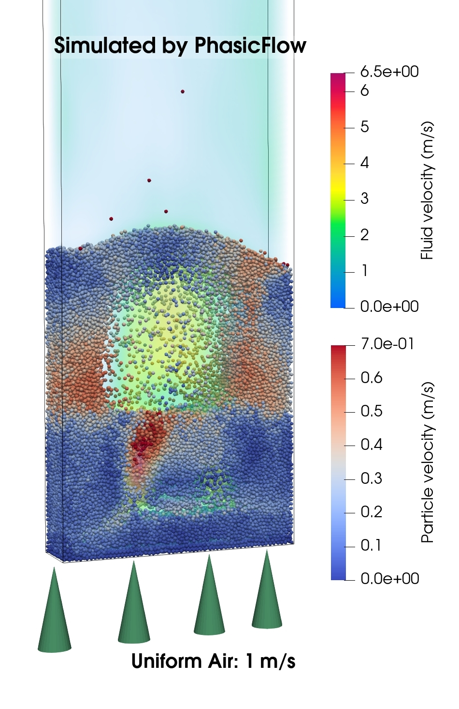

# Fluidized bed using course graining

    - Compatibility: OpenFOAM v2406 and v2412 and PhasicFlow-v-1.0.
    - Solver: unresolvedGrainPFPlus

## 0. Problem Definition

In this tutorial, we will simulate a gas-solid fluidized bed using the unresolved solver `unresolvedGrainPFPlus`. The fluidized bed has dimensions of 0.15x0.7x0.04 m³ and contains 400,000 spherical particles with a diameter of 0.0012 m and a density of 1000 kg/m³. Since, the number of spheres in the simulation is high, we can use course-graining technique to reduce the computational cost. Therefoer, we use the specifict solvers that are tailored for this type of simulation. The course graining factor is chosen to be 2. So, everty 8 spheres form a grain in the simulation and this will results in simulating 50,000 grains.  
Initially, the grains are at rest. Gas is uniformly injected from the bottom of the bed at a superficial velocity of 1.0 m/s. The simulation runs for a total of 10 seconds, with the first second dedicated to the initial packing of particles (pure DEM simulation) and the remaining 9 seconds focused on the fluidized bed simulation.

<div align="center">
<b>

</b>
<b>

A visualization of a gas-solid fluidized bed with the gas field colored based on velocity.
</b></div>

***

## 1. Performing the Simulation Using the Allrun Script

The `Allrun` script is designed to automate the simulation process for the gas-solid fluidized bed using the `unresolvedGrainPFPlus` solver. It manages all essential steps, including mesh generation, DEM simulation, CFD-DEM coupling simulation, and result conversion. The first second of the simulation is dedicated to particle/grains settling, which is a pure DEM simulation using the `grainGranFlow` solver. Following this phase, the CFD-DEM simulation is performed for the remaining 9 seconds. To execute the simulation, follow these steps:

### Step 1: Execute the `Allrun` Script

1. Navigate to the `fluidizedbed` directory.
2. Run the `Allrun` script by executing the following command:

   ```sh
   ./Allrun
   ```

   This script automates the entire simulation workflow, including mesh generation, DEM simulation, CFD-DEM coupling, and result conversion.

### Step 2: Understand the Folder Structure

The simulation folder structure is divided into two main categories: folders containing files related to DEM parameters and folders containing files related to CFD and coupling parameters:

- **DEM-related folders**:
  - **`settings/`**: Contains configuration files for the DEM simulation.
  - **`caseSetup/`**: Includes files for setting up the simulation and physical parameters for particles.

- **CFD-DEM-related folders**:
  - **`FluidField/`**: Holds the initial field data (`alpha`, `p`, `U`) used for the CFD-DEM simulation.
  - **`constant/`**: Contains constant properties for the fluid and parameters for coupling (CFD-DEM).
  - **`system/`**: Contains files for setting up CFD simulation parameters.

### Step 3: Visualize the Results

Once the simulation is complete, the results are converted to VTK format for visualization. The VTK files can be found in the `./VTK` folder. To visualize the results, use the following command:

```sh
paraview foam.foam &
```

Open `foam.foam` file in ParaView to view the CFD results. For DEM results, open the `./VTK/particles.vtk.series` file.

## 2. Description of setup files

To learn about how to set up a DEM simulation, please refer to the [tutorial page](https://github.com/PhasicFlow/phasicFlow/wiki/Tutorials) of PhasicFlow and other online documents along side this package. Also, you can refer to OpenFOAM tutorials to learn about how to set up a CFD simulation. The solver we are using here, essentially is a combination of DEM and CFD component, with some additional parameters that are essential for unresolved coupling. Here, we only describe the simulation setup files that are specific to the coupling part.

The most important setup file for CFD-DEM simulation is `constant/couplingProperties`. It contains parameters for coupling between CFD and DEM with two main sub-dictionaries: `unresolved` and `particleMapping`. 

The `unresolved` dictionary contains parameters for unresolved coupling including:
- `distributionMethod`: The method for distributing particle properties across cells (e.g., `adaptiveGaussian`, `GaussianIntegral`, `diffusion`)
- `porosity`: Method for calculating fluid volume fraction (e.g., `distribution`, `subDivision29`)
- `momentumInteraction`: Settings for momentum coupling including drag, lift, and velocity evaluation methods

The `particleMapping` dictionary contains parameters for particle mapping onto the CFD mesh and MPI parallelization.

For detailed information about all coupling parameters, refer to the main coupling system documentation in `phasicFlowCoupling/couplingSystem/unresolved/README.md`.

Another important case setup file for course graining is `caseSetup/shapes`. The original spheres were 0.0012 m, and with coarse-graining factor 2, the grain diameter is 0.0024 m. These are set accordingly in this file:

```C++
// file: caseSetup/shapes

names           (grain1);     // names of shapes 
grainDiameters	(0.0024);     // diameter of grains 
sphereDiameters	(0.0012);     // diameter of spheres 
materials       (grainMat);   // material names for shapes
```