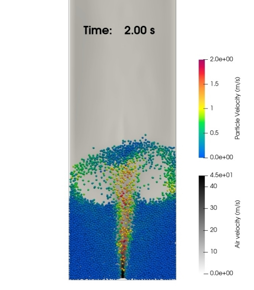

# Simulating a Flat-Bottom Spouted Bed

## 1 — Problem definition

This tutorial shows how to simulate a flat-bottom spouted bed with three distinct bottom inlets. The bed width is 14.5 cm; a central jet with a width of 0.5 cm produces the spouting. The bed contains 12,000 spherical particles (diameter 3 mm, density 2505 kg/m3). The DEM timestep is 1e-5 s and the CFD timestep is 5e-5 s to keep the Courant number below 1. Air at ambient conditions is used: the background superficial air velocity is 2 m/s (entering the bed from the bottom) and the jet velocity is 43.5 m/s. The simulation has two phases: (1) particle settling from t = 0 to t = 1 s (pure DEM) and (2) spouting using air from t = 1 to t = 10 s (CFD–DEM coupling).

<div align="center">
<b>A view of the flat-bottom spouted bed.</b>
<div>

</div>
</div>

## 2 — Setting up the case for the DEM part

PhasicFlow cases are configured via text scripts in the `settings` and `caseSetup` folders. Run commands from the simulation case top-level directory (where `caseSetup` and `settings` reside).

### Creating particles

In `settings/particlesDict`, two dictionaries — `positionParticles` and `setFields` — define particle positions and initial field values.

The `positionParticles` dictionary uses the `ordered` method to position particles in a box region. `orderedInfo` sets `numPoints` = 12,000, `distance` = 0.003 m, and `axisOrder` = (z x y).

<div align="center">
in <b>settings/particlesDict</b>
</div>

```C++
positionParticles
{
    method ordered;

    orderedInfo
    {
        numPoints   12000;
        distance    0.003;
        axisOrder   (z x y);
    }

    regionType box;

    boxInfo
    {
        min (0.005 0.01 0.005);
        max (0.140 2.40 0.009);
    }
}
```

The `setFields` dictionary defines initial particle fields (velocity, rotational velocity, and shape name). Ensure the `shapeName` matches the name in `caseSetup/shapes` (here, `sph1`).

<div align="center">
in <b>settings/particlesDict</b>
</div>

```C++
setFields
{
    defaultValue
    {
        velocity        realx3  (0.0 0 0);  // linear velocity (m/s)
        rVelocity       realx3  (0 0 0);    // rotational velocity (rad/s)
        shapeName       word    sph1;       // particle shape name
    }

    selectors
    {}
}
```

To create particles and save them in time folder `0`, run:

```bash
particlesPhasicFlow
```

### Creating geometry

The `surfaces` dictionary defines walls. This case uses a built-in cuboid wall. Provide the center point and edge lengths to define the cuboid.

<div align="center">
in <b>settings/geometryDict</b>
</div>

```C++
surfaces
{
    allWall
    {
        type        cuboidWall;
        center      (0.0725 0.375 0.010);
        edgeLength  (0.1450 0.75 0.020);
        numDivs     (3 14 1);
        material    wallMat;
    }
}
```

To create and save geometry in `0/geometry`, run:

```
geometryPhasicFlow
```

### Defining properties and interactions

In `caseSetup/interaction` define material properties and interaction parameters. `materials` lists material names and `densities` their densities. The `model` dictionary specifies contact force and rolling friction models and related parameters.

<div align="center">
in <b>caseSetup/interaction</b>
</div>

```C++
materials   (sphereMat wallMat);
densities   (2505 2500);
contactListType   sortedContactList;

model
{
    contactForceModel nonLinearLimited;
    rollingFrictionModel normal;

    // Young modulus [Pa]
    Yeff (1.0e6 1.0e6   
                1.0e6);

    // Shear modulus [Pa]
    Geff (0.8e6 0.8e6   
                0.8e6);

    // Poisson's ratio [-]
    nu  (0.25 0.25   
              0.25);

    // coefficient of normal restitution
    en  (0.97  0.97      
               0.97);

    // dynamic friction
    mu  (0.65   0.65     
                0.65);

    // rolling friction
    mur (0.1  0.1      
              0.1);
}
```

In `caseSetup/shapes`, define particle names, diameters, and materials:

<div align="center">
in <b>caseSetup/shapes</b>
</div>

```C++
names     (sph1);
diameters (0.003);
materials (sphereMat);
```

### Simulation domain and boundaries

`settings/domainDict` defines a rectangular bounding box. Particles exiting the box are deleted.

<div align="center">
in <b>settings/domainDict</b>
</div>

```C++
// Simulation domain: particles outside this domain will be deleted
globalBox
{
    min (0.0 0.0 0.0);
    max (0.15 0.75 0.02);
}

boundaries
{
    left
    {
        type     exit;    // other options: periodic, reflective 
    }

    right
    {
        type     exit;    // other options: periodic, reflective 
    }

    bottom
    {
        type     exit;    // other options: periodic, reflective 
    }

    top
    {
        type     exit;    // other options: periodic, reflective 
    }

    rear
    {
        type     exit;    // other options: periodic, reflective 
    }

    front
    {
        type     exit;    // other options: periodic, reflective 
    }
}
```

### Other settings

Additional parameters live in `settings/settingsDict`: timesteps, start/end times, save intervals, gravity, and integration method.

<div align="center">
in <b>settings/settingsDict</b>
</div>

```C++
dt             0.00001;     // time step for integration (s)

startTime      0;           // start time for simulation 

endTime        1;           // end time for simulation 

saveInterval   0.05;        // time interval for saving the simulation

timePrecision  4;           // maximum number of digits for time folder 

g              (0 -9.8 0);  // gravity vector (m/s2)

includeObjects (diameter);  // save necessary (i.e., required) data on disk

integrationMethod       AdamsBashforth4;  // integration method

integrationHistory      off;  

writeFormat             binary; 

timersReport            Yes; // report timers (Yes or No)
```

## 3 — Running particle settling (DEM)

To let particles settle, run:

```bash
sphereGranFlow
```

## 4 — Case setup for the CFD–DEM coupling

For coupling, edit `couplingProperties` under `constant`. This example uses the DiFelice drag closure and `adaptiveGaussian` for mapping particle properties to fluid cells. Because the jet region has small cells, `adaptiveGaussian` is a suitable choice even when the cell-to-particle-size ratio is about 1.

<div align="center">
in <b>settings/couplingProperties</b>
</div>

```C++
unresolved
{
    cellDistribution
    {
        // type of cell distribution method (if required) 
        //    self: no distribution (cell itself)
        //    Gaussian: distribute values on sorounding cells based on a neighbor length
        //    adaptiveGaussian: similar to Gaussian, but it adapts the distribution 
        //    GaussianIntegral: Uses Gaussian integral for determining particle distribution
        //    diffusion: uses diffusion smoothing for property distribution over cells.  
        type                adaptiveGaussian;
        maxLayers           2;
    }

    porosity
    {
        // Options are PIC, subDivision29Mod, subDivision9, cellDistribution
        method      cellDistribution;

        // minimum alpha allowed 
        alphaMin    0.2;
    }

    drag
    {
        // Drag force closure, other options are ErgunWenYu, Rong
        type                DiFelice; 

        // Method for calculating the fluid velocity which is used in drag force calculations
        //   cell: uses fluid velocity of the cell that contains the particle center 
        //   particle: uses interpolated fluid velocity on the particle center based on 
        //             cell values around particle
        fluidVelocity       cell;

        // Method for calculating the solid velocity which is used in drag calculations 
        //   cell: solid velocity is averaged on the cell using cellDistribution method 
        //         and this average value is used as particle velocity in calculations 
        //   particle: the actual particle velocity is used in calculations 
        solidVelocity       particle;  

        // Whether to distribute calculated particle drag force onto cells
        //   off: add the calculated drag force on the cell itself
        //   on: distributes the calculated drag force on cells (using cellDistribution method)
        cellDistribution    on; 

        // residual Reynolds number 
        residualRe          10e-6;
    }
}
```

Because the CFD–DEM part starts at t = 1 s, copy the `FluidField` contents into the time folder `1`. Copy the files `U`, `p`, and `alpha` to folder `1`. These represent fluid velocity, pressure, and fluid volume fraction, respectively. The velocity boundary conditions in `U` are:

```C++
boundaryField
{
    inlet_left
    {
        type            fixedValue;
        value           uniform (0.0 2.0 0);
    }

    inlet_middle
    {
        type            uniformFixedValue;
        uniformValue    table
        (
            (1.2     (0 0 0))
            (1.3     (0 43.5 0))
        );
    }

    inlet_right
    {
        type            fixedValue;
        value           uniform (0.0 2.0 0);
    }

    defaultFaces
    {
        type            noSlip;
        value           uniform (0 0 0);
    }

    outlet
    {
        type            zeroGradient;
    }
}
```

The background velocity is (0 2 0) from the start. The central jet (`inlet_middle`) is zero until t = 1.2 s, then ramps linearly to 43.5 m/s between t = 1.2 s and t = 1.3 s, and remains at that value thereafter.

## 5 — Running the spouting-bed simulation (CFD–DEM)

After copying the fluid fields into folder `1`, run:

```bash
blockMesh
unresolvedSpherePFPlus
```

## 6 — Post-processing

To convert results to VTK for ParaView:

```bash
pFlowToVTK --binary
```

This command converts all simulation results (particles and geometry) to VTK format and saves them in the `VTK/` folder. You can then open these files in ParaView. To export specific fields:

```bash
pFlowToVTK --binary --fields diameter velocity id
```

To view CFD and DEM results together in ParaView, use the `foam.foam` dummy file to load CFD results into ParaView.
