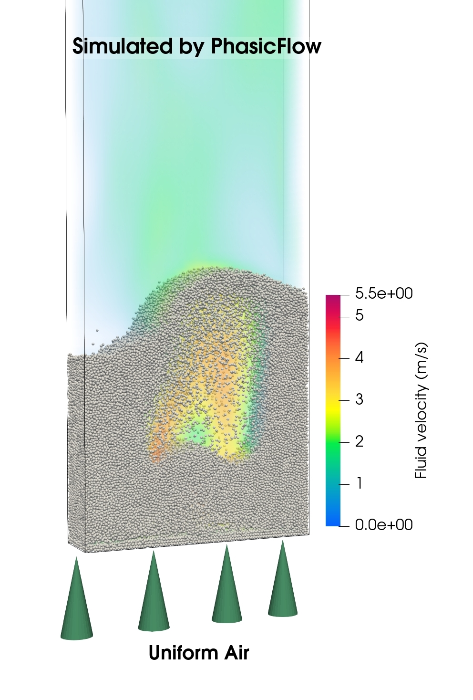

# Fluidized bed

    - Compatibility: OpenFOAM v2406 and v2412 and PhasicFlow-v-1.0.
    - Solver: unresolvedSpherePFPlus

## 0. Problem Definition

In this tutorial, we will simulate a gas-solid fluidized bed using the unresolved solver `unresolvedSpherePFPlus`. The fluidized bed has dimensions of 0.15x0.7x0.04 m³ and contains 100,000 spherical particles with a diameter of 0.0018 m and a density of 1000 kg/m³. Initially, the particles are at rest. Gas is uniformly injected from the bottom of the bed at a superficial velocity of 1.3 m/s. The simulation runs for a total of 10 seconds, with the first second dedicated to the initial packing of particles (pure DEM simulation) and the remaining 9 seconds focused on the fluidized bed simulation.

<div align="center">
<b>

</b>
<b>

A visualization of a gas-solid fluidized bed with the gas field colored based on velocity.
</b></div>

***

## 1. Performing the Simulation Using the Allrun Script

The `Allrun` script is designed to automate the simulation process for the gas-solid fluidized bed using the `unresolvedSpherePFPlus` solver. It manages all essential steps, including mesh generation, DEM simulation, CFD-DEM coupling simulation, and result conversion. The first second of the simulation is dedicated to particle settling, which is a pure DEM simulation using the `sphereGranFlow` solver. Following this phase, the CFD-DEM simulation is performed for the remaining 9 seconds. To execute the simulation, follow these steps:

### Step 1: Execute the `Allrun` Script

1. Navigate to the `fluidizedbed` directory.
2. Run the `Allrun` script by executing the following command:

   ```sh
   ./Allrun
   ```

   This script automates the entire simulation workflow, including mesh generation, DEM simulation, CFD-DEM coupling, and result conversion.

### Step 2: Understand the Folder Structure

The simulation folder structure is divided into two main categories: folders containing files related to DEM parameters and folders containing files related to CFD and coupling parameters:

- **DEM-related folders**:
  - **`settings/`**: Contains configuration files for the DEM simulation.
  - **`caseSetup/`**: Includes files for setting up the simulation and physical parameters for particles.

- **CFD-DEM-related folders**:
  - **`FluidField/`**: Holds the initial field data (`alpha`, `p`, `U`) used for the CFD-DEM simulation.
  - **`constant/`**: Contains constant properties for the fluid and parameters for coupling (CFD-DEM).
  - **`system/`**: Contains files for setting up CFD simulation parameters.

### Step 3: Visualize the Results

Once the simulation is complete, the results are converted to VTK format for visualization. The VTK files can be found in the `./VTK` folder. To visualize the results, use the following command:

```sh
paraview foam.foam &
```

Open the `foam.foam` file in ParaView to view the CFD results. For DEM results, open the `./VTK/particles.vtk.series` file.

## 2. Description of setup files

To learn about how to set up a DEM simulation, please refer to the [tutorial page](https://github.com/PhasicFlow/phasicFlow/wiki/Tutorials) of PhasicFlow and other online documents along side this package. Also, you can refer to OpenFOAM tutorials to learn about how to set up a CFD simulation. The solver we are using here, essentially is a combination of DEM and CFD component, with some additional parameters that are essential for unresolved coupling. Here, we only describe the simulation setup files that are specific to the coupling part.

The most important setup file for CFD-DEM simulation is `constant/couplingProperties`. It contains the parameters for coupling between CFD and DEM, such as drag force closure model, porosity model and etc. It contains two main sub-dictionaries: `unresolved` and `particleMapping`. The `unresolved` dictionary contains the parameters for unresolved coupling, while the `particleMapping` dictionary contains the parameters for particle mapping onto the CFD mesh and MPI parallelization of simulation. The parameters in `particleMapping` sub-dictionary are left unchanged, since they are the best settings and we rarely want to change them, although they are here to enable users to manage some special cases.

`unresolved` sub-dictionary contains these main parts:

- `distributionMethod`: This parameter defines the method of distributing particle properties (like volume, drag force) across the cells. The options are:

  - `PCM`: Particle Centroid Method - no distribution, direct assignment to cell containing particle center.
  - `Gaussian`: Distributes property over surrounding cells based on a Gaussian distribution using a specified `standardDeviation` value (distribution width).
  - `GaussianIntegral`: Similar to `Gaussian`, but uses the integral of the Gaussian function for distribution.
  - `adaptiveGaussian`: Similar to Gaussian method, but adapts the distribution based on local cell size and particle size. This is the most flexible and accurate method for distributing particle properties across cells.
  - `diffusion`: Uses Laplacian diffusion smoothing to distribute particle properties across cells.
  - `subDivision29`: Divides particle sphere into 29 equal volumetric segments for high-accuracy porosity calculations.
  - `subDivision9`: Divides particle sphere into 9 equal volumetric segments, offering good balance between accuracy and computational cost.

- `porosity`: This part defines the method for calculating porosity. The options are:
  - `distribution`: Uses the selected `distributionMethod` to distribute particle volume over cells and calculate porosity.
  - `subDivision29`: Uses the 29-subdivision method for high-accuracy porosity calculations.
  - `subDivision9`: Uses the 9-subdivision method for porosity calculations.

- `momentumInteraction`: This section contains all momentum coupling related settings:

  - `momentumExchange`: Controls how momentum exchange terms are distributed to fluid cells. Options are:
    - `cell`: No smoothing, assigned to cell containing particle.
    - `distribution`: Uses `distributionMethod` for smoothing momentum terms across cells.

  - `fluidVelocity`: Defines how fluid velocity at particle location is evaluated:
    - `cell`: Uses fluid velocity of the cell containing the particle center.
    - `interpolate`: Interpolates fluid velocity from neighboring cells to particle center.
    - `distribution`: Uses `distributionMethod` for volume-averaged velocity evaluation.

  - `solidVelocity`: Defines how particle velocity is evaluated in coupling calculations:
    - `particle`: Uses exact particle velocity directly.
    - `distribution`: Uses `distributionMethod` to obtain volume-averaged velocity in cell; this average is used for all particles in that cell.

  - `drag`: Defines drag force model and parameters:
    - `model`: Drag closure options are `DiFelice`, `ErgunWenYu`, `Beetstra`, `Rong`, `Cello`.
    - `residualRe`: Minimum Reynolds number threshold to prevent numerical issues.

  - `lift`: Defines lift force model and surface rotation torque:
    - `model`: Lift force options are `none` (default), `Saffmann`, `Loth2008`, `Shi2019`.
    - `surfaceRotationTorque`: Torque model options are `none`, `lowReynolds`, `Loth2008`, `Shi2019`.
    - `residualRe`: Minimum Reynolds number threshold.

```C++
// constant/couplingProperties file 
unresolved
{
    // Distribution method for mapping particle data (porosity, velocity,
    // force, etc.) over fluid cells
    // 
    // Available methods: 
    //     - PCM: Particle Centroid Method (no smoothing)
    //     - diffusion: Laplacian diffusion for smoothing
    //     - Gaussian: Gaussian distribution with specified std dev
    //     - GaussianIntegral: Gaussian integral for distributing data
    //     - adaptiveGaussian: Gaussian with adaptive std deviation
    //     - subDivision29: Divided-volume method (29-sub-volume version)
    //     - subDivision9: Divided-volume method (9-sub-volume version)
    distributionMethod      adaptiveGaussian;
    
    // Distribution method required settings 
    adaptiveGaussianInfo
    {
        maxLayers           1;          // optional default: 1
        smoothingFactor     1.0;        // optional, default: 1.0
    }

    // Required settings for calculating porosity method 
    porosity
    {
        // method is optional
        //    - default value is distribution
        //    - Other options: subDivision29, subDivision9 
        method      distribution; 

        // alphaMin is minimum alpha allowed in porosity calculations
        alphaMin    0.2;
    }

    // Settings for momentum coupling  
    momentumInteraction
    {
        // How to perform smoothing on momentum exchange terms
        // Available options are: 
        //    - cell: No smoothing, assigned to containing cell
        //    - distribution: Uses distributionMethod for smoothing
        momentumExchange distribution; 

        // How to evaluate fluid velocity at particle location
        // Available options are: 
        //    - cell: Uses cell value
        //    - interpolate: Interpolates from neighboring cells
        //    - distribution: Uses distributionMethod for averaging
        fluidVelocity    distribution;

        // How to evaluate particle velocity in calculations
        // Available options are:
        //    - particle: Uses exact particle velocity
        //    - distribution: Uses distributionMethod to obtain average
        //      velocity in the cell for all particles
        solidVelocity    particle;

        drag
        {
            // Drag force closure
            // Available options for spherical particles:
            //   - DiFelice, ErgunWenYu, Rong, Cello, Beetstra
            model       DiFelice; 

            // Residual Reynolds number 
            residualRe  1.0e-6;
        }

        lift
        {   
            // Lift force model options:
            //   - none: Not included (default)
            //   - Saffmann: Saffman (1965), low Re
            //   - Loth2008: Loth (2008), intermediate Re
            //   - Shi2019: Shi & Rzehak (2019), wide Re range
            model                   none;

            // Surface rotation torque model options:
            //    - none: Not included (default)
            //    - lowReynolds: Happel and Brenner model
            //    - Loth2008: Based on Loth (2008) model
            //    - Shi2019: Based on Shi model
            surfaceRotationTorque   none; 

            residualRe              1.0e-6;
        }

        virtualMass
        {
            // This part has not been implemented yet
        }
    }

}

particleMapping
{
    // based on the maximum particle diameter in the simulation.
    domainExpansionRatio    1;

    domainUpdateInterval    0.01;

    decompositionMode       facePlanes;
}
```
