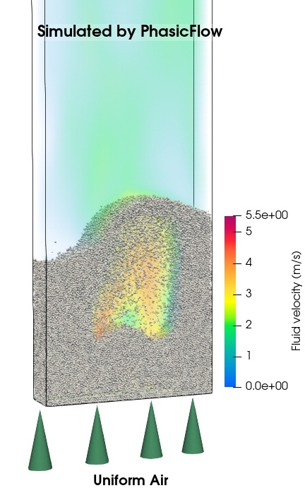

# Fluidized bed

## Problem definition 

We are going to simulate a gas-solid fluidized bed using the unresolved solver `unresolvedSpherePFPlus`. The dimensions of the fluidized bed is 0.15x0.7x0.04 m3. The bed is filled with 100,000 spherical particles of 0.0018 m diameter with density 1000 kg/m3, which are initially at rest. The gas is uniformly injected from the bottom of the bed with a superficial velocity of 1.3 m/s. The simulation will run for 10 seconds. The first second of the simulation is used for initial packing of particles (pure DEM simulation) and the following 9 seconds are used for the fluidized bed simulation.

<div align="center">
<b>

</b>
<b>

A view of gas-solid fluidized bed
</b></div>

***

## 1. How to Perform the Simulation using Allrun Script

`Allrun` is a script designed to automate the simulation process for the gas-solid fluidized bed using the `unresolvedSpherePFPlus` solver. It handles all necessary steps, including mesh generation, DEM simulation, CFD-DEM coupling simulation, and result conversion. , 
To simulate the gas-solid fluidized bed, follow these steps:

### Step 1: Run the `Allrun` Script

1. Navigate to the `fluidizedbed` directory.
2. Execute the `Allrun` script:
   ```sh
   ./Allrun
   ```

   This script automates the simulation process, including mesh generation, DEM simulation, CFD-DEM coupling, and result conversion.

### Step 2: Understand the Sub-Folders

The first second of simulation is dedicated to the settling of particles. It is a pure DEM simulation with solver `sphereGranFlow`. After this phase, the CFD-DEM simulation is pefromed up to 10 s. The folder structure of simulation consistes of two main parts, folders that contain files related to DEM parameters, and folder that contain files related to CFD and coupling parameters:

- **DEM related folders**:
  - **`settings/`**: Contains configuration files for the DEM simulation.
  - **`caseSetup/`**: Includes files for setting up the simulation/physical parameters for particles.
- **CFD-DEM related folders**:
  - **`FluidField/`**: Holds the initial field data (`alpha`, `p`, `U`) used for the CFD-DEM simulation.
  - **`constant/`**: Contains constant properties for fluid and parameters for coupling (CFD-DEM).
  - **`system/`**: Contains files for setting up CFD simulation parameters.

### Step 3: View Results

After the simulation completes, results are converted to VTK format for visualization. You can find the VTK files in the `./VTK` folder. Execute the following command to visualize the reusults:
```sh
paraview foam.foam &
```
use the `foam.foam` file to open the CFD results in ParaView. And to visualize DEM results, open `./VTK/particles.vtk.series`

